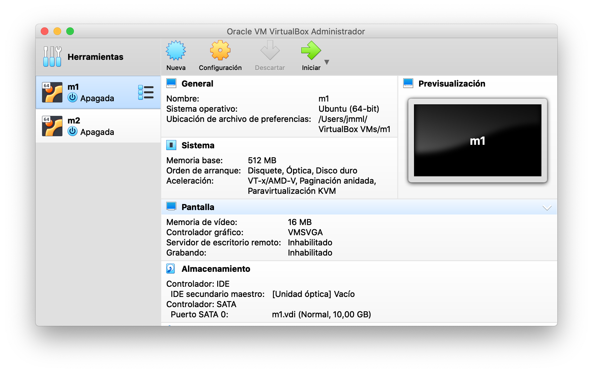
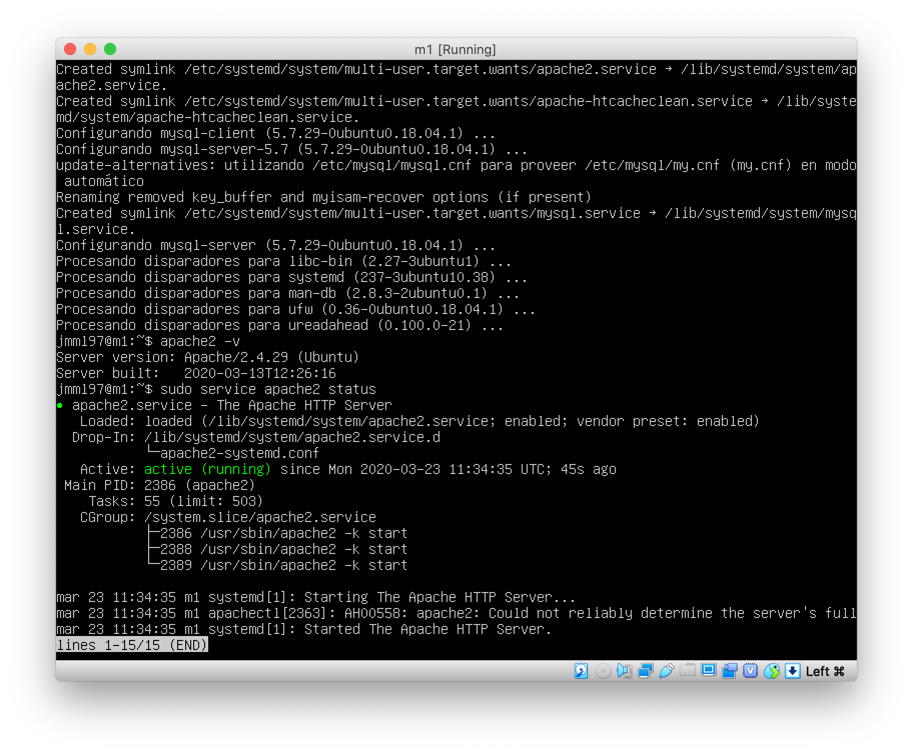
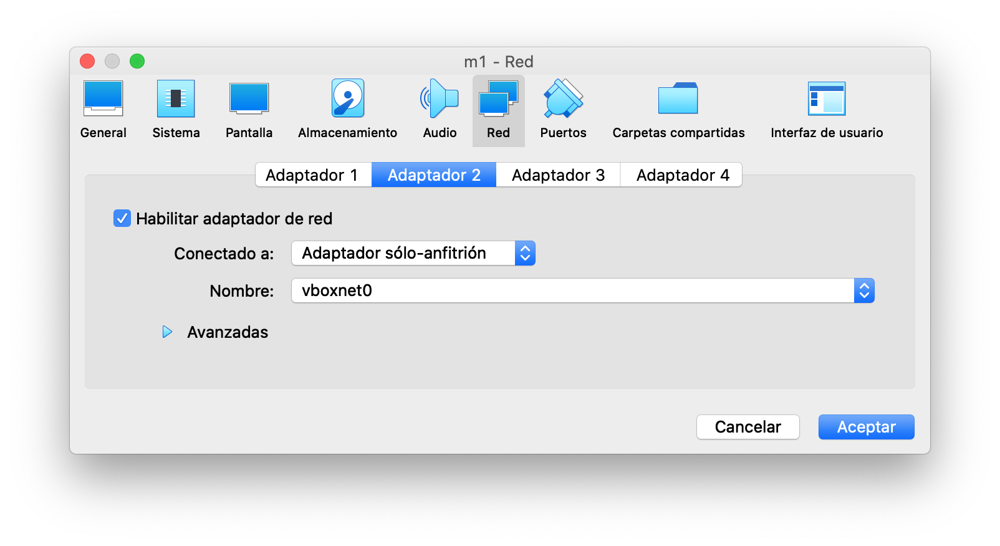
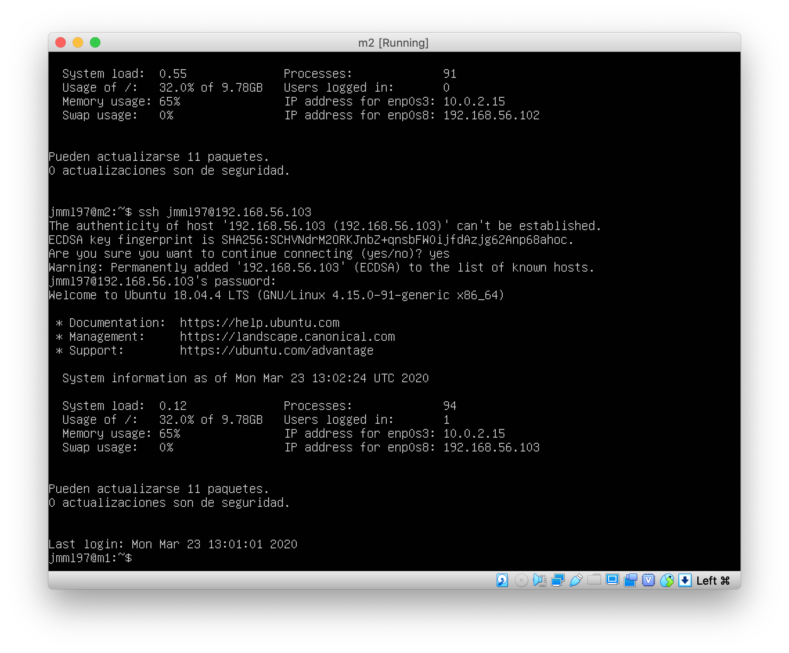
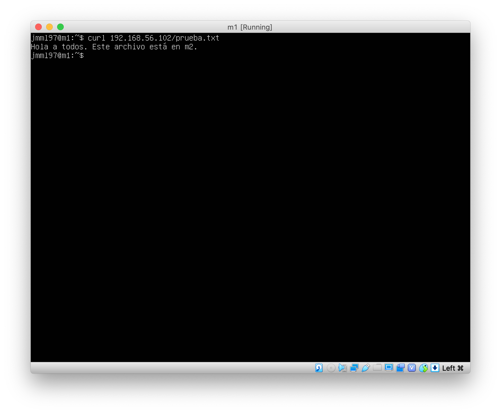

Primero se han creado dos máquinas, `m1` y `m2` siguiendo las instrucciones y parámetros descritos en el guion.



Entramos en cada una de las máquinas e instalamos Ubuntu Server 18.04.4 siguiendo los pasos que se indican.
Seleccionamos la opción de instalar openSSH.
Tras completar la instalación, reiniciamos e iniciamos sesión con nuestras credenciales.
Procedemos ahora a instalar LAMP, con la orden

```
sudo apt-get install apache2 mysql-server mysql-client
```

Comprobamos que efectivamente Apache está funcionando, como se puede ver en la siguiente imagen.



Repetimos la instalación en la máquina `m2`.

Ahora tenemos que configurar la conexión entre ambas máquinas.
Para ello primero vamos a crear las interfaces adecuadas en cada una de ellas.



Una vez creadas vamos a configurar `netplan`.
Para ello creamos en ambas máquinas el archivo `/etc/netplan/config.yaml`, en el que configuramos las interfaces:
```
network:
  version: 2
  renderer: networkd
  ethernets:
    enp0s3:
      dhcp4: true
    enp0s8:
      dhcp4: true
```

Una vez configurado he conseguido acceder mediante `ssh` desde `m2` a `m1`, como se puede observar en la siguiente imagen.



Para probar la conexión de `m1` a `m2` he creado un archivo `prueba.txt` en `m2` y lo he colocado en la carpeta `var/www/html`.
Com se puede observar en la siguiente imagen, es posible acceder a dicho archivo utilizando `curl` en `m1`.

