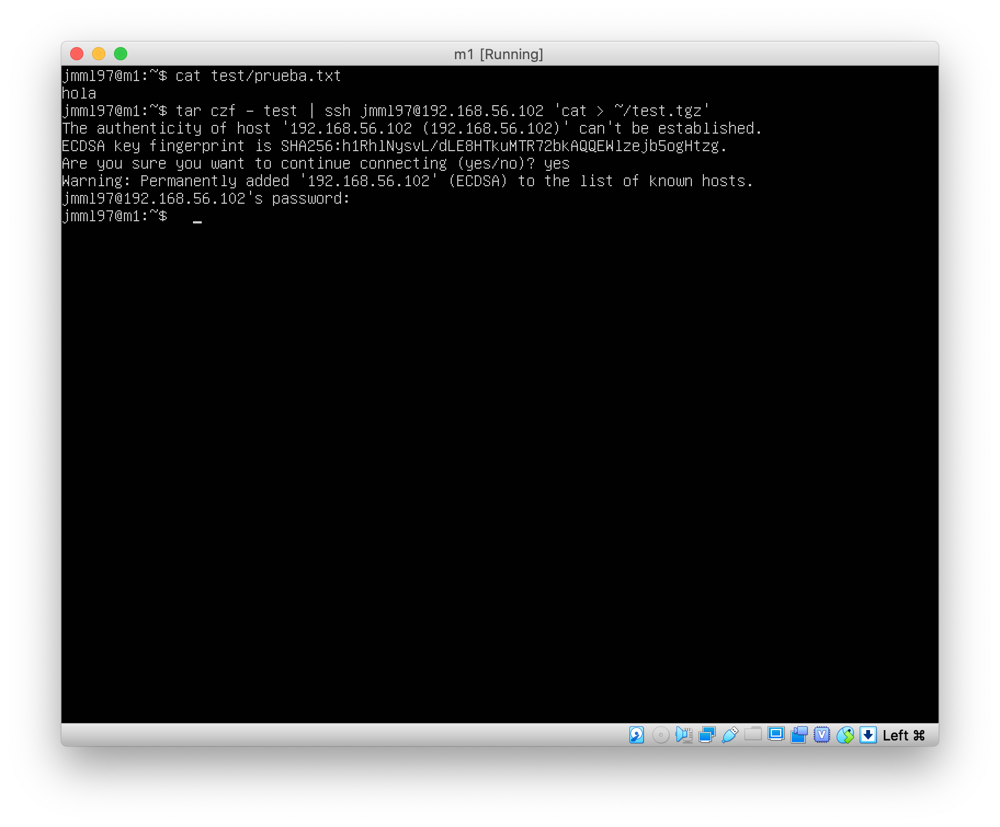
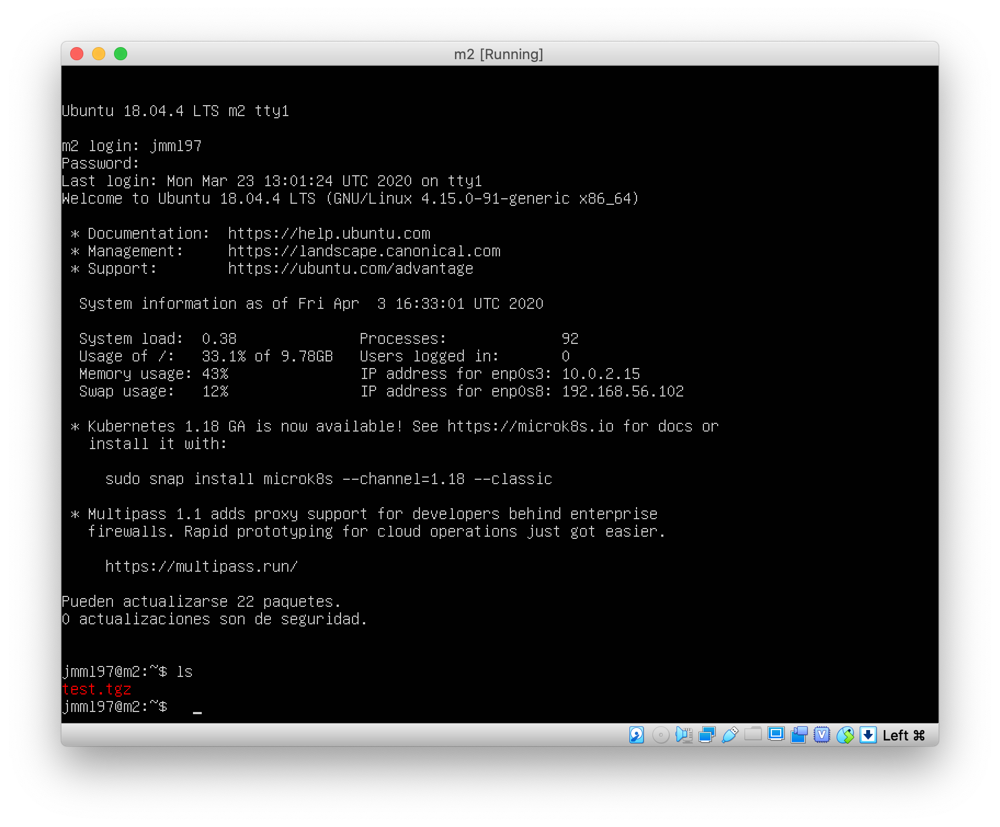
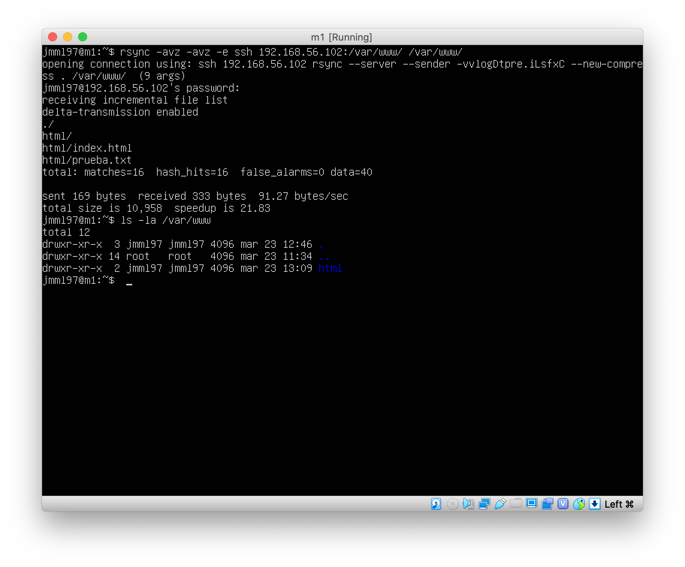
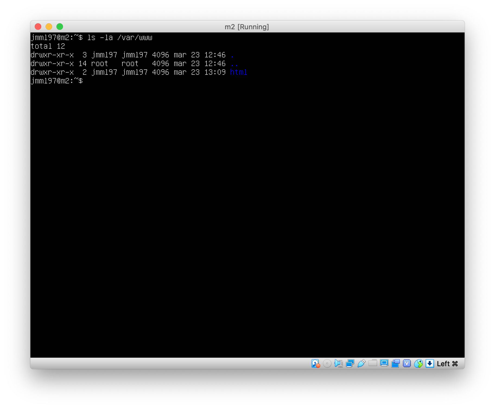
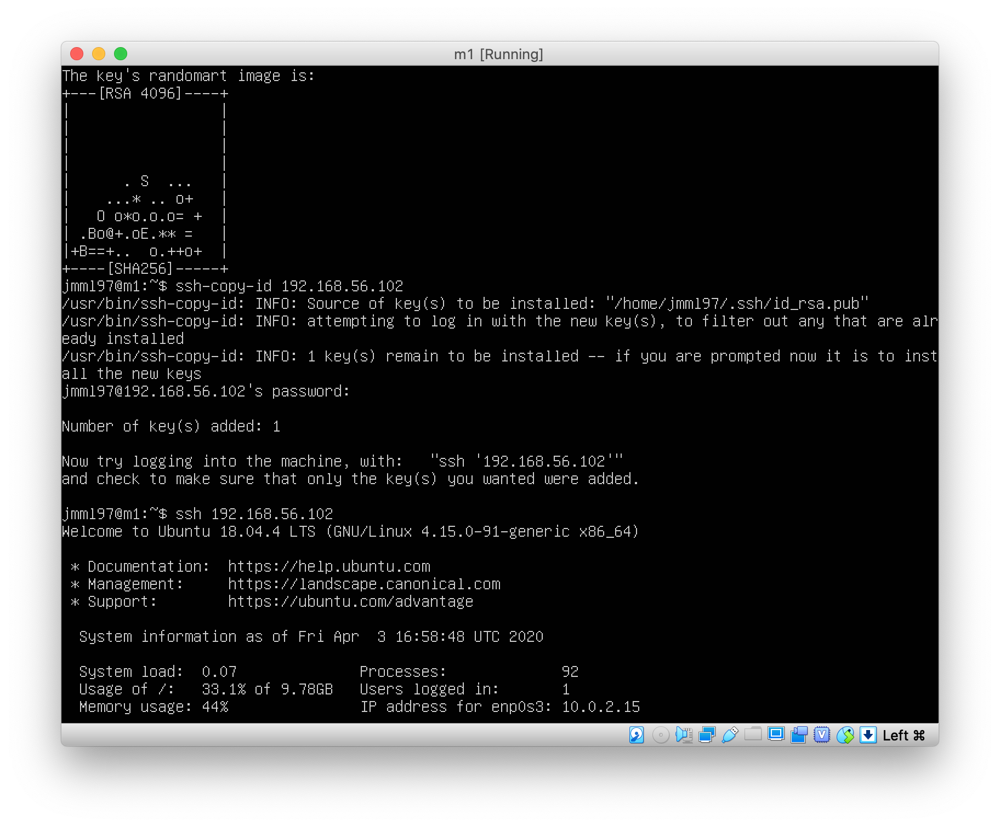
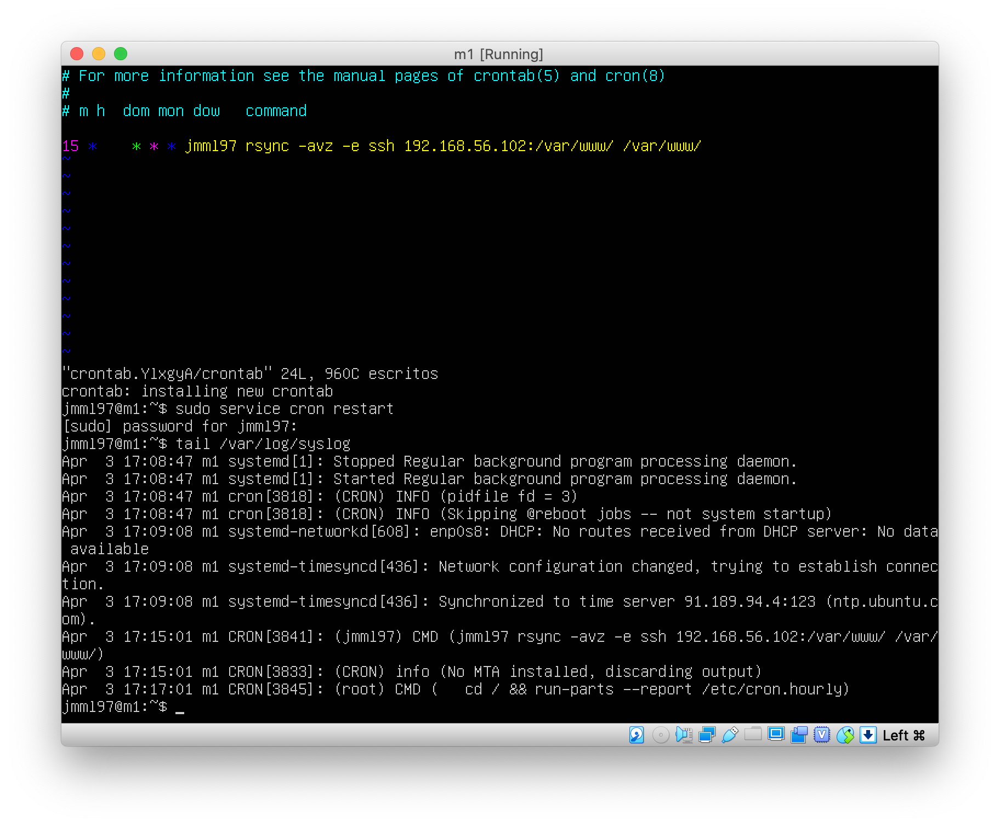

# Copia por SSH

Continuamos usando las máquinas `m1` y `m2` de la práctica anterior.
Creamos un directorio en la máquina `m1` llamado `test` y creamos un archivo `prueba.txt`.
Vamos a copiarlo mediante `ssh` a la máquina `m2` —comprimiéndolo primero mediante la orden `tar`—.
En las imágenes siguientes comprobamos el proceso y el resultado de dicha copia.





# Clonado de una carpeta

Instalamos `rsync` en ambas máquinas mediante `apt-get`.
Vamos a copiar el contenido de `/var/www` en `m1` a `m2`.
Ejecutamos la orden
```
rsync -avz -e ssh 192.168.56.102:/var/www/ /var/www/
```
El resultado de esta orden en ambas máquinas puede observarse en las siguientes imágenes.





# SSH sin contraseña

Generamos las claves en ambas máquinas mediante `ssh-keygen` con el siguiente comando:
```
ssh-keygen -b 4096 -t rsa
```

Dejamos el campo *passphrase* en blanco.
Copiamos las claves mediante `ssh-copy-id`.
En la siguiente imagen podemos ver todo este proceso en la máquina `m1`, así como el acceso a la máquina `m2` sin contraseña.



# Programar tareas con `crontab`

Edito el archivo `/etc/crontab` con la orden `crontab -e` y añado la línea
```
15 *    * * * jmml97 rsync -avz -e ssh 192.168.56.102:/var/www/ /var/www/
```

A continuación utilizo `sudo service cron restart` para reiniciar el servicio.
Finalmente, compruebo en el archivo `/var/log/syslog` que la tarea se ejecuta correctamente, como se puede comprobar en la siguiente imagen.

