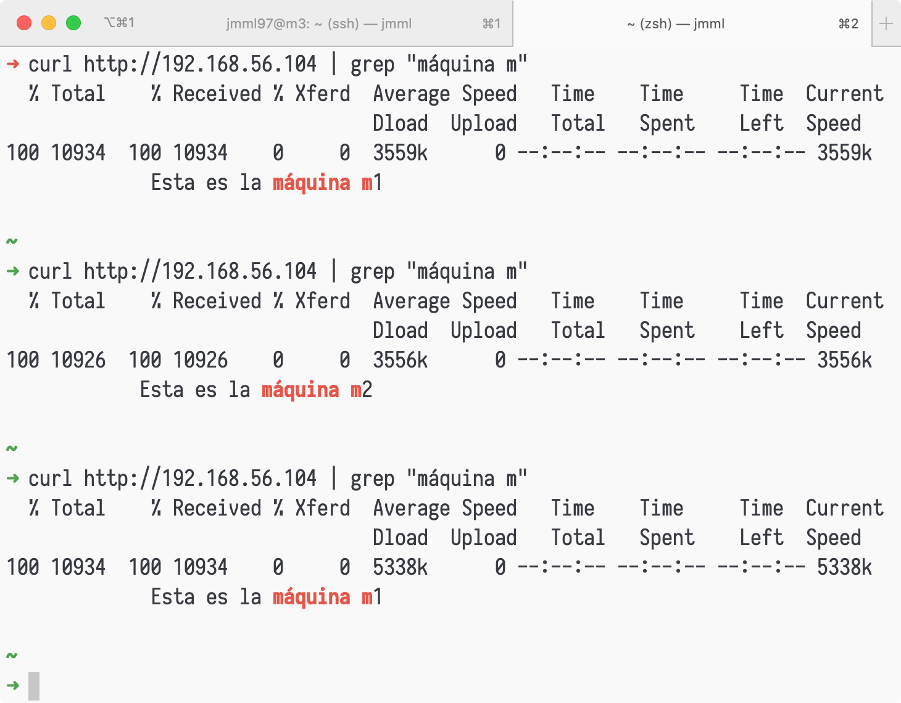
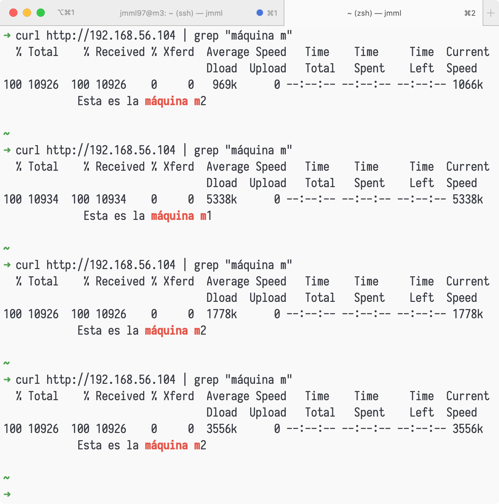
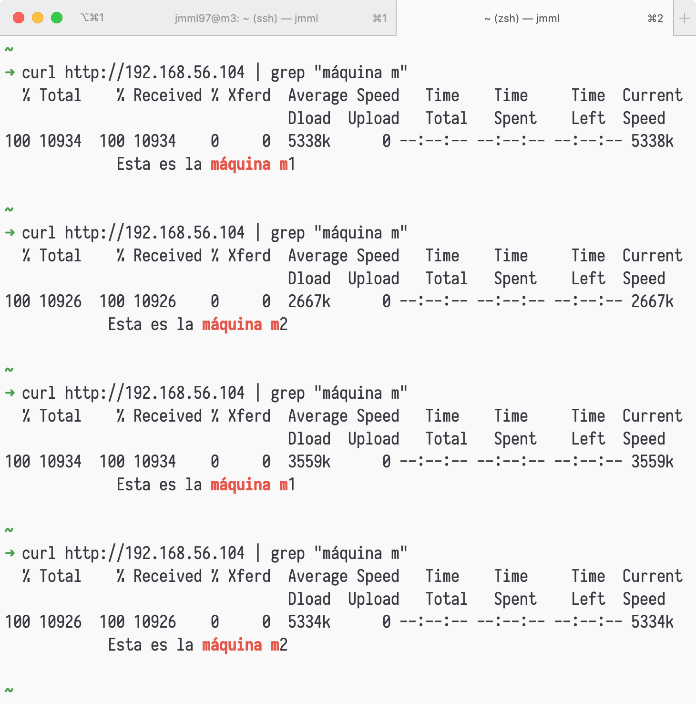
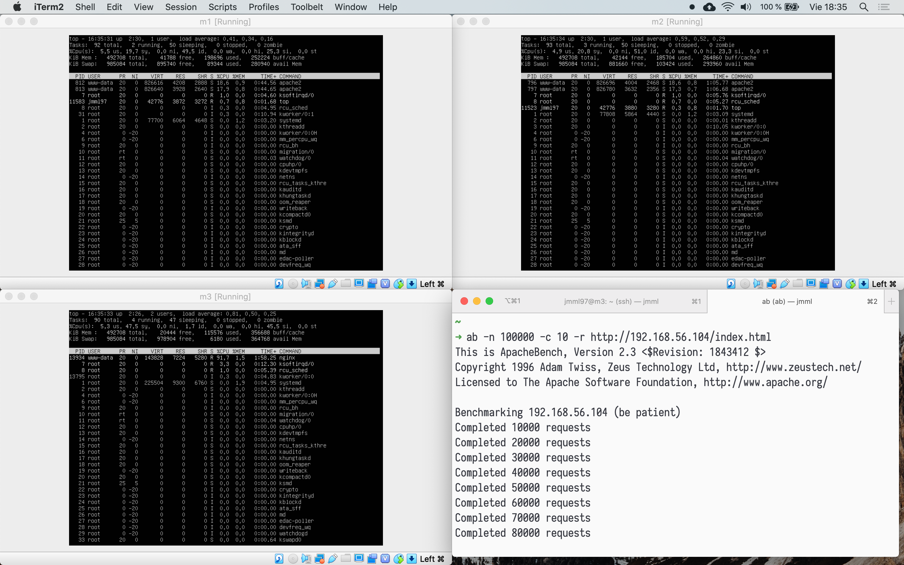
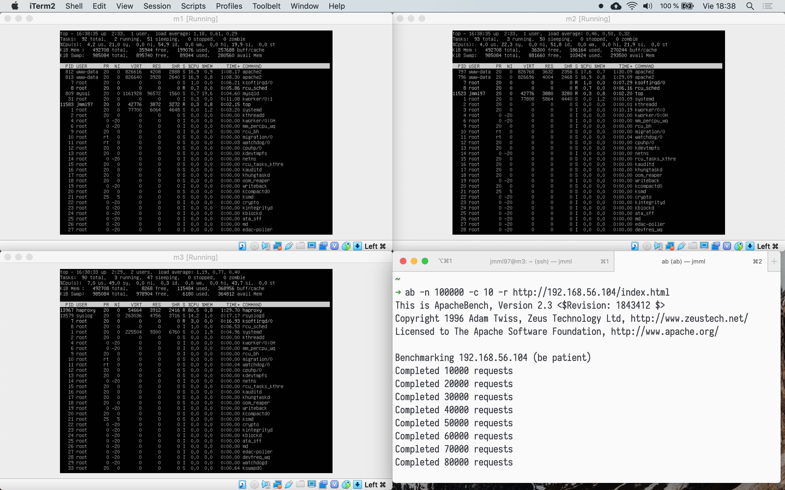

Hemos creado una tercera máquina —`m3`— que es la que actuará como balanceador de carga.

Probamos ahora ambos balanceadores, `nginx` y `haproxy`.

# nginx

Instalamos y activamos `nginx` en la máquina `m3` con los comandos descritos.

```
sudo apt-get update && sudo apt-get dist-upgrade && sudo apt-get autoremove
sudo apt-get install nginx 
sudo systemctl start nginx
```

Configuramos `nginx` como se muestra a continuación.
```
upstream servidoresSWAP { 
  server 192.168.56.103;
  server 192.168.56.102; 
}

server {
  listen 80;
  server_name balanceador;

  access_log /var/log/nginx/balanceador.access.log; 
  error_log /var/log/nginx/balanceador.error.log; 
  root /var/www/;

  location / {
    proxy_pass http://servidoresSWAP;
    proxy_set_header Host $host;
    proxy_set_header X-Real-IP $remote_addr;
    proxy_set_header X-Forwarded-For $proxy_add_x_forwarded_for; 
    proxy_http_version 1.1;
    proxy_set_header Connection ""; 
  }
}
```

Tenemos que editar también el archivo `/etc/nginx/nginx.conf` para asegurar que `nginx` funciona como balanceador de carga, comentando la línea sobre `include`.



Podemos añadir pesos a los servidores, modificando el archivo de configuración de la siguiente forma.

```
upstream servidoresSWAP { 
  server 192.168.56.103 weight=1;
  server 192.168.56.102 weight=2; 
}
```

Así, probando de nuevo obtenemos los siguientes resultados. El servidor `m2` recibe más carga.



# haproxy

Instalamos y activamos `haproxy` en la máquina `m3` con los comandos descritos.

Modificamos la configuración en el archivo `/etc/haproxy/haproxy.cfg`.

```
frontend http-in 
  bind *:80
  default_backend servidoresSWAP

backend servidoresSWAP
  server m1 192.168.56.103:80 maxconn 32 
  server m2 192.168.56.102:80 maxconn 32
```

Tras reiniciar el servicio podemos comprobar que está funcionando correctamente.
Hay que recordar desactivar primero el servicio `nginx`.



# Tests con ab

Se han realizado dos tests con `ab`, de 100 000 conexiones cada uno, utilizando primero `nginx` como balanceador y `haproxy` después.

Con `nginx` (sin pesos) se han obtenido los siguientes resultados:

| | |
|-|-|
Time per request:|       15.381 [ms] (mean)
Time per request:|       1.538 [ms] (mean, across all concurrent requests)



Con `haproxy` (sin pesos) se han obtenido los siguientes resultados:

| | |
|-|-|
Time per request:|       14.362 [ms] (mean)
Time per request:|       1.436 [ms] (mean, across all concurrent requests)



Concluimos que `haproxy` ofrece mejores resultados, pues el tiempo de respuesta es menor.