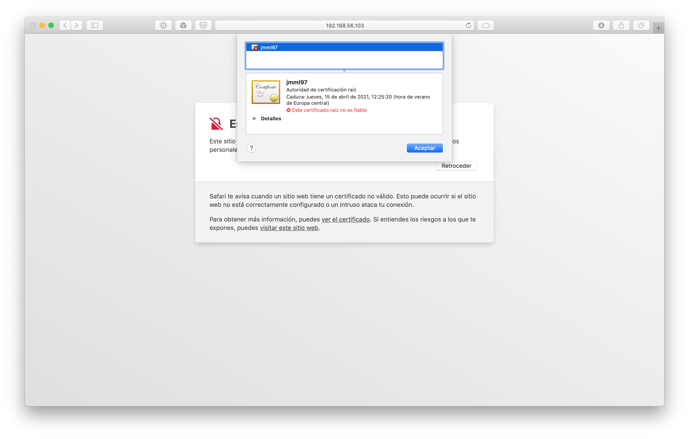
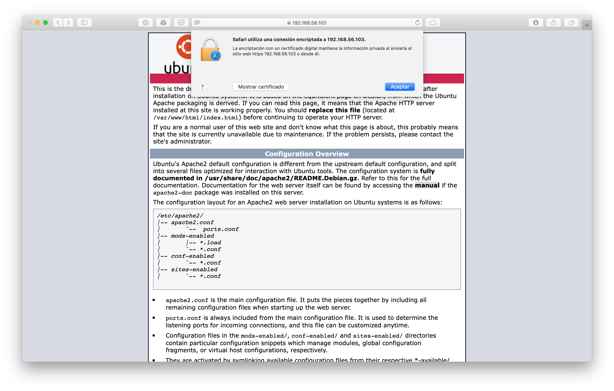
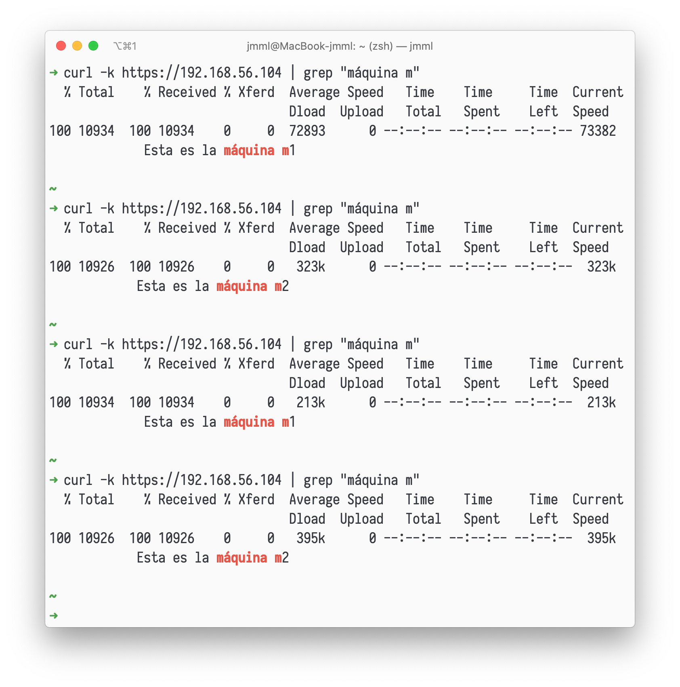
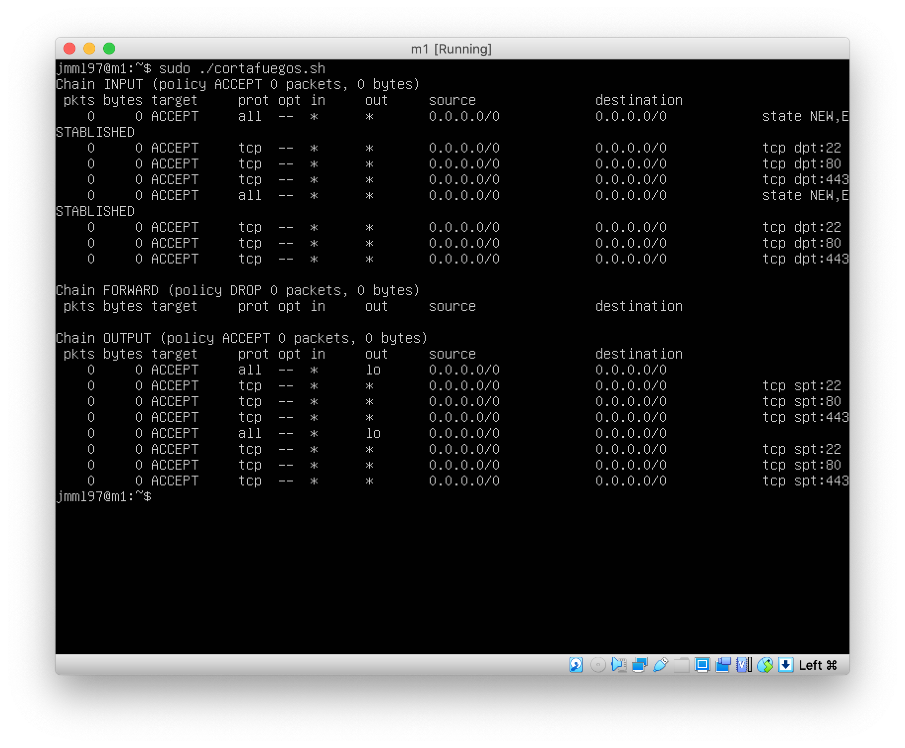

# Instalar certificados SSL autofirmados

Vamos a instalar certificados SSL autofirmados en nuestras máquinas para poder utilizar conexiones HTTPS.

Vamos a comenzar instalando el certificado en la máquina `m1` siguiendo los pasos descritos en el guion:

```
> sudo a2enmod ssl
> sudo service apache2 restart
> sudo mkdir /etc/apache2/ssl
> sudo openssl req -x509 -nodes -days 365 -newkey rsa:2048 -keyout 
  /etc/apache2/ssl/apache.key -out /etc/apache2/ssl/apache.crt
```

Tras ajustar el archivo de configuración `/etc/apache2/sites-available/default-ssl.conf` y recargar Apache podemos acceder a la web a través de HTTPS, como podemos ver a continuación.





Ahora vamos a copiar los certificados al resto de máquinas mediante `scp` para poder realizar peticiones HTTPS al balanceador.

```
> sudo scp /etc/apache2/ssl/apache.crt jmml97@192.168.56.102:/home/
  jmml97/apache.crt
> sudo scp /etc/apache2/ssl/apache.key jmml97@192.168.56.102:/home/
  jmml97/apache.key
> sudo scp /etc/apache2/ssl/apache.crt jmml97@192.168.56.104:/home/
  jmml97/apache.crt
> sudo scp /etc/apache2/ssl/apache.key jmml97@192.168.56.104:/home/
  jmml97/apache.key
```

Configuramos Apache en la máquina `m2` como lo habíamos hecho en la máquina `m1` y configuramos `nginx` añadiendo al archivo de configuración las siguientes líneas.

```
listen 443 ssl;
ssl on;
ssl_certificate /home/jmml97/apache.crt; ssl_certificate_key /home/
  jmml97/apache.key;
```

Recargamos `nginx` y probamos a ejecutar `curl` desde nuestra máquina, comprobando que el balanceador funciona correctamente con HTTPS, como podemos ver en la siguiente imagen.



# Configuración del cortafuegos

Vamos a utilizar `iptables` para configurar un cortafuegos.

```
# (1) Eliminar todas las reglas (configuración limpia) 
iptables -F
iptables -X
iptables -Z
iptables -t nat -F

# (2) Política por defecto: denegar todo el tráfico entrante 
iptables -P INPUT DROP
iptables -P OUTPUT ACCEPT
iptables -P FORWARD DROP
iptables -A INPUT -m state --state NEW,ESTABLISHED -j ACCEPT

# (3) Permitir cualquier acceso desde localhost (interface lo) 
iptables -A INPUT -i lo -j ACCEPT
iptables -A OUTPUT -o lo -j ACCEPT

# (4) Abrir el puerto 22 para permitir el acceso por SSH 
iptables -A INPUT -p tcp --dport 22 -j ACCEPT
iptables -A OUTPUT -p tcp --sport 22 -j ACCEPT

# (5) Permitir el tráfico por el puerto 80 (HTTP) 
iptables -A INPUT -p tcp --dport 80 -j ACCEPT 
iptables -A OUTPUT -p tcp --sport 80 -j ACCEPT

# (6) Permitir el tráfico por el puerto 443 (HTTPS) 
iptables -A INPUT -p tcp --dport 443 -j ACCEPT 
iptables -A OUTPUT -p tcp --sport 443 -j ACCEPT

iptables -L -n -v
```

Para que la configuración se realice al inicio vamos a crear un servicio de systemd.
Creamos el archivo `cortafuegos.service` en `/etc/systemd/system/`, cuyo contenido describimos a continuación[^1].

[^1]: https://www.linode.com/docs/quick-answers/linux/start-service-at-boot/

```
[Unit]
Description=Script del cortafuegos.
After=network-online.target

[Service]
Type=simple
ExecStart=/home/jmml97/cortafuegos.sh

[Install]
WantedBy=multi-user.target
```

Lo activamos con la siguiente orden.

```
> sudo systemctl enable cortafuegos
```

Podemos ver la configuración del cortafuegos en la siguiente imagen.

