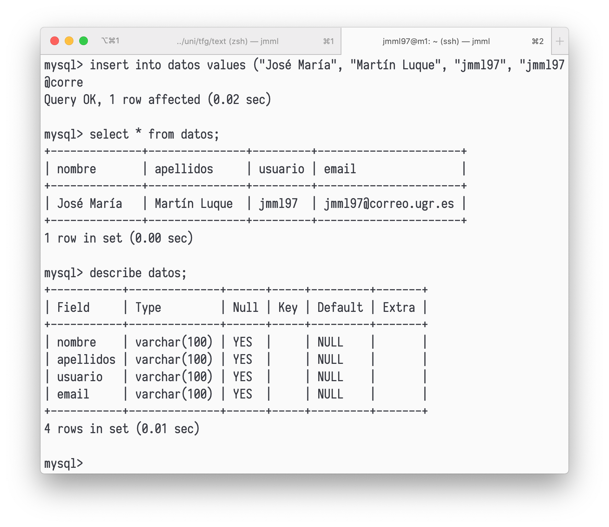

# Crear BD en m1

Vamos a comenzar creando una base de datos en la máquina `m1`.
Seguimos las instrucciones descritas en el guion y creamos la base de datos `estudiante` y la tabla `datos`.
Hemos insertado los datos correspondientes, como se puede ver en la siguiente figura.



# Replicar BD con mysqldump

Vamos a replicar el contenido de una base de datos con `mysqldump`.

Primero bloqueamos la escritura en la base datos con la orden de MySQL `FLUSH TABLES WITH READ LOCK;`.
A continuación ejecutamos `mysqldump`:

```
> sudo mysqldump estudiante -u root -p > /tmp/estudiante.sql
```

y desbloqueamos la base de datos con `UNLOCK TABLES;`.

El contenido del archivo `estudiante.sql` es el siguiente:

```
-- MySQL dump 10.13  Distrib 5.7.29, for Linux (x86_64)
--
-- Host: localhost    Database: estudiante
-- ------------------------------------------------------
-- Server version	5.7.29-0ubuntu0.18.04.1

/*!40101 SET @OLD_CHARACTER_SET_CLIENT=@@CHARACTER_SET_CLIENT */;
/*!40101 SET @OLD_CHARACTER_SET_RESULTS=@@CHARACTER_SET_RESULTS */;
/*!40101 SET @OLD_COLLATION_CONNECTION=@@COLLATION_CONNECTION */;
/*!40101 SET NAMES utf8 */;
/*!40103 SET @OLD_TIME_ZONE=@@TIME_ZONE */;
/*!40103 SET TIME_ZONE='+00:00' */;
/*!40014 SET @OLD_UNIQUE_CHECKS=@@UNIQUE_CHECKS, UNIQUE_CHECKS=0 */;
/*!40014 SET @OLD_FOREIGN_KEY_CHECKS=@@FOREIGN_KEY_CHECKS, FOREIGN_KEY_CHECKS=0 */;
/*!40101 SET @OLD_SQL_MODE=@@SQL_MODE, SQL_MODE='NO_AUTO_VALUE_ON_ZERO' */;
/*!40111 SET @OLD_SQL_NOTES=@@SQL_NOTES, SQL_NOTES=0 */;

--
-- Table structure for table `datos`
--

DROP TABLE IF EXISTS `datos`;
/*!40101 SET @saved_cs_client     = @@character_set_client */;
/*!40101 SET character_set_client = utf8 */;
CREATE TABLE `datos` (
  `nombre` varchar(100) DEFAULT NULL,
  `apellidos` varchar(100) DEFAULT NULL,
  `usuario` varchar(100) DEFAULT NULL,
  `email` varchar(100) DEFAULT NULL
) ENGINE=InnoDB DEFAULT CHARSET=latin1;
/*!40101 SET character_set_client = @saved_cs_client */;

--
-- Dumping data for table `datos`
--

LOCK TABLES `datos` WRITE;
/*!40000 ALTER TABLE `datos` DISABLE KEYS */;
INSERT INTO `datos` VALUES ('José María','Martín Luque','jmml97','jmml97@correo.ugr.es');
/*!40000 ALTER TABLE `datos` ENABLE KEYS */;
UNLOCK TABLES;
/*!40103 SET TIME_ZONE=@OLD_TIME_ZONE */;

/*!40101 SET SQL_MODE=@OLD_SQL_MODE */;
/*!40014 SET FOREIGN_KEY_CHECKS=@OLD_FOREIGN_KEY_CHECKS */;
/*!40014 SET UNIQUE_CHECKS=@OLD_UNIQUE_CHECKS */;
/*!40101 SET CHARACTER_SET_CLIENT=@OLD_CHARACTER_SET_CLIENT */;
/*!40101 SET CHARACTER_SET_RESULTS=@OLD_CHARACTER_SET_RESULTS */;
/*!40101 SET COLLATION_CONNECTION=@OLD_COLLATION_CONNECTION */;
/*!40111 SET SQL_NOTES=@OLD_SQL_NOTES */;

-- Dump completed on 2020-05-01 11:33:03
```

Copiamos el archivo `sql` en la máquina `m2` mediante `scp` como se describe a continuación.

```
> sudo scp /tmp/estudiante.sql jmml97@192.168.56.102:/tmp/estudiante.sql
```

En la máquina `m2` creamos la base de datos `estudiante`: 

```
mysql> create database estudiante;
```

y copiamos los datos en ella a partir del archivo `sql`.

```
jmml97@m2> sudo mysql -u root -p estudiante < /tmp/estudiante.sql
```

En las siguientes imágenes podemos ver el resultado de estos comandos.


# Replicación mediante una configuración maestro-esclavo

Configuramos MySQL en las máquina `m1` y `m2`, comentando el parámetro `bind-address` y fijando los archivos de error y los identificadores.

A continuación creamos el usuario esclavo en la máquina `m1`, como se ve en la siguiente imagen.


Y ahora configuramos la máquina `m2` para hacer de esclavo.


Si en MySQL en la máquina `m2` ejecutamos el comando `show slave status;` observamos que `Seconds_Behind_Master` es `0`, distinto de `NULL` luego está funcionando correctamente.
Podemos comprobarlo fácilmente insertando nuevos datos en la base de datos desde la máquina `m1` y comprobando desde la máquina `m2` que se han actualizado correctamente, como podemos ver en las siguientes imágenes.


