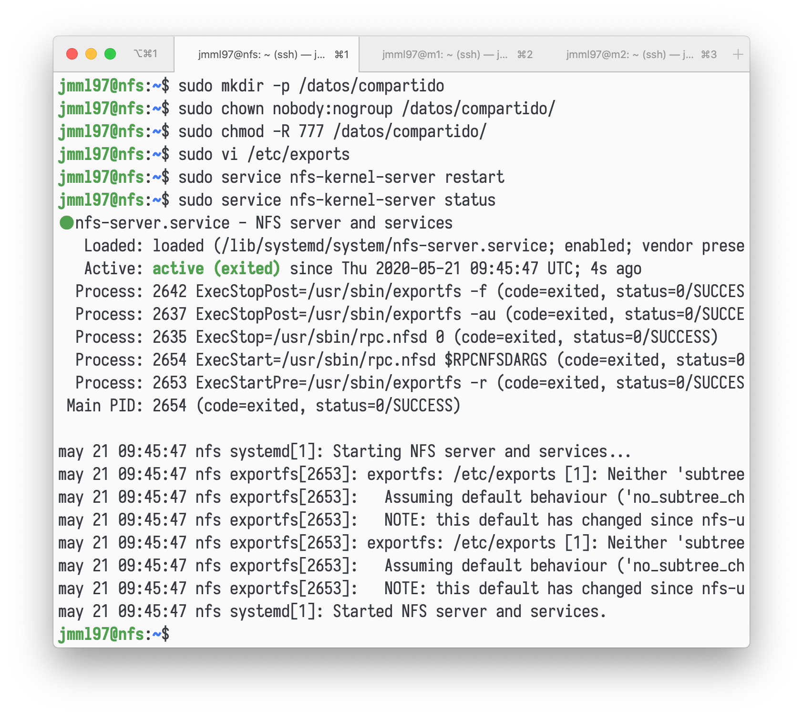
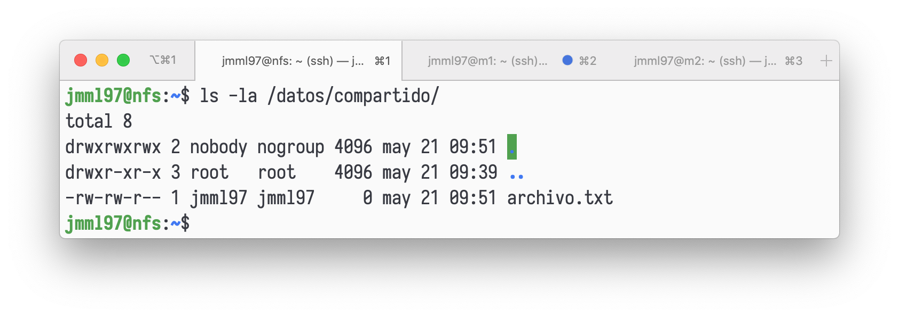
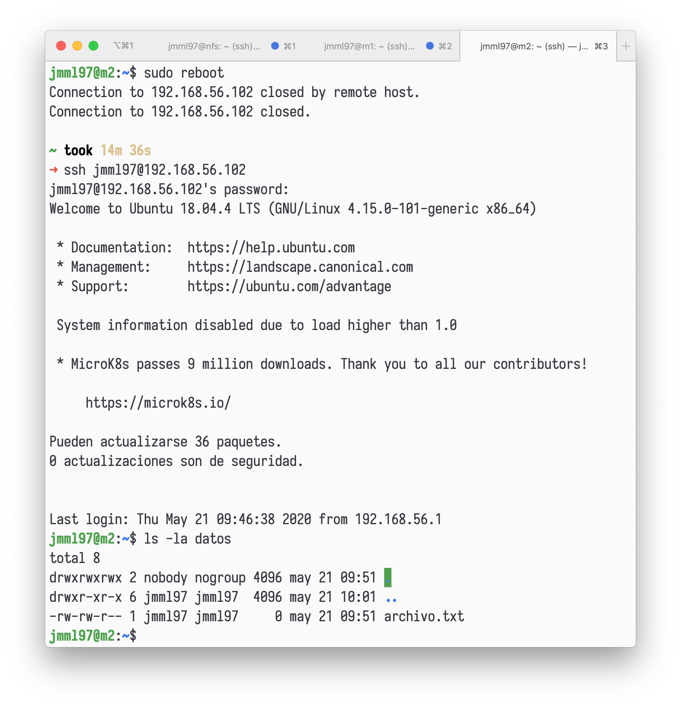

# Configurar máquina como servidor NFS

Creamos una máquina `nfs` como hicimos en la práctica 1.
Instalamos los paquetes necesarios para NFS, como se indica a continuación.

```
sudo apt-get install nfs-kernel-server nfs-common rpcbind
```

Creamos el directorio y asignamos permisos:

```
sudo mkdir -p /datos/compartido
sudo chown nobody:nogroup /datos/compartido/
sudo chmod -R 777 /datos/compartido/
```

Modificamos el archivo `/etc/exports/` para que las máquinas `m1` y `m2` puedan escribir:

```
/datos/compartido/ 192.168.56.103(rw) 192.168.56.102(rw)
```

Reiniciamos el servicio y comprobamos que todo funciona correctamente.



# Configuración de los clientes M1 y M2

Tenemos que instalar el cliente NFS, crear una carpeta y enlazarla, en ambas máquinas.

```
sudo apt-get install nfs-common rpcbind
mkdir datos
chmod -R 777 datos
sudo mount 192.168.56.106:/datos/compartido datos
```

Podemos comprobar ahora que si añadimos un archivo desde una máquina, digamos `m2`, aparecerá en `nfs`. 
Lo vemos en las siguientes imágenes.




Finalmente, para que la carpeta se monte con el arranque, editamos el archivo `fstab` en ambas máquinas, añadiendo:

```
192.168.56.106:/datos/compartido /home/jmml97/datos/ nfs auto,noatime,
 nolock,bg,nfsvers=3,intr,tcp,actimeo=1800 0 0
```



# Seguridad en el servidor NFS

Aplicamos la configuración de denegación por defecto del tráfico entrante:

```
iptables -P INPUT DROP
iptables -P OUTPUT ACCEPT
iptables -P FORWARD DROP
iptables -A INPUT -m state --state ESTABLISHED,RELATED -j ACCEPT
```

Modificamos los puertos de `mountd` y `nlockmgr`.
Editamos el archivo `/etc/defaults/nfs- kernel-server`, cambiando la siguiente línea:

```
RPCMOUNTDOPTS="--manage-gids -p 2000"
```

Creamos el archivo `swap-nfs-ports.conf` en `/etc/sysctl.d/`, añadiendo: 

```
fs.nfs.nlm_tcpport = 2001
fs.nfs.nlm_udpport = 2002
```

Aplicamos la configuración y reiniciamos.

```
sudo sysctl --system 
/etc/init.d/nfs-kernel-server restart
```

Podemos comprobar los puertos con `rpcinfo`, como vemos en la siguiente imagen.
(Por algún motivo me daba `connection timed out` desde la propia máquina, así que lo comprobé desde `m2`.)


Añadimos permisos a `iptables` en los puertos que necesitamos para NFS:

```
iptables -A INPUT -s 192.168.56.103,192.168.56.102 -p tcp -m 
 multiport --ports 111,2000,2001,2049 -j ACCEPT
iptables -A INPUT -s 192.168.56.103,192.168.56.102 -p udp -m 
 multiport --ports 111,2000,2002,2049 -j ACCEPT
```

En las siguientes imágenes comprobamos que todo funciona correctamente.


